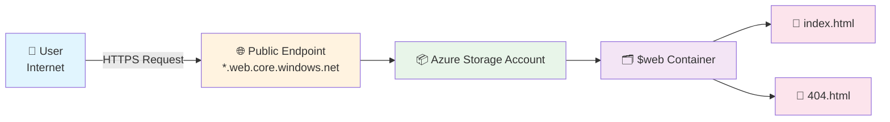

# Lab 01: Hosting a Static Website on Azure Blob Storage

## 🎥 Live Demonstration Video

> 
>https://www.loom.com/share/3b3c3a84162f466d8d5ce6374e311c67
> 

---

## 📋 Overview

This lab walks through deploying a fully serverless static website using **Azure Blob Storage's static website hosting feature**. Rather than provisioning a virtual machine or web server to serve a simple HTML page, Azure Storage handles the underlying infrastructure — giving a hands-on introduction to **PaaS (Platform as a Service)** concepts and how Azure abstracts away compute management for simple workloads.

By the end of this lab, a single HTML page is publicly accessible via an Azure-provided endpoint, with no servers to patch, scale, or maintain.

---

## 🏗️ Architecture Diagram



**Flow Summary:**
1. A user requests the site via the public static website endpoint generated by Azure.
2. Azure Storage routes the request to the `$web` container — a special, reserved container created automatically when static website hosting is enabled.
3. The requested file (`index.html` or `404.html` for errors) is served directly from Blob Storage — no compute layer involved.

---

## ✅ Prerequisites

- [ ] An active Azure subscription (Free Tier is sufficient)
- [ ] Basic familiarity with the Azure Portal navigation
- [ ] A text editor (VS Code, Notepad, TextEdit, etc.)

---

## 🏷️ Naming Convention Used

| Resource | Naming Pattern | Example |
|---|---|---|
| Resource Group | `rg-lab01-[yourname]` | `rg-lab01-name` |
| Storage Account | `stlab01[yourname]` | `stlab01name` |
| Region | East US | — |

> ⚠️ **Note:** Storage account names must be globally unique across all of Azure, lowercase only, and contain no special characters.

---

## 🛠️ Implementation Steps

### Phase 1 — Create the Resource Group
1. Log in to the [Azure Portal](https://portal.azure.com).
2. Search for **Resource Groups** → **+ Create**.
3. Set Subscription, name it `rg-lab01-[yourname]`, and select **East US** as the region.
4. **Review + create** → **Create**.

### Phase 2 — Create the Storage Account
1. Search for **Storage accounts** → **+ Create**.
2. Configure:
   - **Resource group:** `rg-lab01-[yourname]`
   - **Storage account name:** `stlab01[yourname]`
   - **Region:** East US
   - **Performance:** Standard
   - **Redundancy:** Locally-redundant storage (LRS)
3. **Review + create** → **Create**, then **Go to resource**.

### Phase 3 — Enable Static Website Hosting
1. In the storage account, go to **Data management → Static website**.
2. Toggle to **Enabled**.
3. Set:
   - **Index document name:** `index.html`
   - **Error document path:** `404.html`
4. Click **Save**.
5. **Copy the Primary endpoint URL** — this is the public site address (e.g., `https://stlab01name.z13.web.core.windows.net/`).

### Phase 4 — Create the Website Content
A minimal `index.html` is included in this repo under [`/site/index.html`](./site/index.html). It contains a simple styled landing page confirming successful deployment.

### Phase 5 — Upload Content
1. In the storage account, go to **Data storage → Containers**.
2. Open the auto-created **`$web`** container.
3. Click **Upload** and select `index.html`.

### Phase 6 — Validate
1. Open the **Primary endpoint URL** in a new browser tab.
2. Confirm the page renders correctly.

---

## 🧪 Validation Checklist

- [ ] Resource group `rg-lab01-[yourname]` exists
- [ ] Storage account static website hosting shows **Enabled**
- [ ] `$web` container contains `index.html`
- [ ] Public endpoint URL loads the page without errors

---

## 🐛 Troubleshooting

| Issue | Cause | Fix |
|---|---|---|
| `404 - The requested content does not exist` | File not named exactly `index.html`, or uploaded to the wrong container | Confirm the filename is lowercase `index.html` and was uploaded to the **`$web`** container specifically |
| `Storage account name is already taken` | Storage account names are globally unique across **all** Azure tenants | Append random digits to the name, e.g., `stlab01name99` |
| Site loads but shows old content | Browser caching | Hard refresh (Ctrl+Shift+R) or test in an incognito window |

---

## 🧹 Cleanup

To avoid unnecessary costs and keep your environment tidy:

1. Navigate to **Resource Groups**.
2. Select `rg-lab01-[yourname]`.
3. Click **Delete resource group**.
4. Type the resource group name to confirm.
5. Click **Delete**.

> 💡 Deleting the resource group removes the storage account and all contained data — this is the fastest and safest way to fully decommission lab resources.

---

## 🎯 Key Concepts Demonstrated

- **PaaS vs. IaaS:** Hosting content without managing a server or OS
- **Azure Blob Storage internals:** the special-purpose `$web` container
- **Static website hosting:** index/error document configuration
- **Cost-conscious design:** LRS redundancy tier for non-critical lab workloads
- **Resource lifecycle management:** proper cleanup via resource group deletion

---

## 📁 Repository Structure

```
.
├── README.md
└── site/
    └── index.html
```

---

## 📜 License

This lab documentation is provided for educational purposes.
